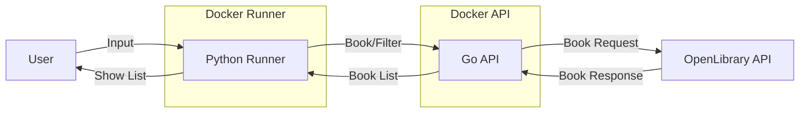

 

# Open Library Go API

This project is a book search service powered by the OpenLibrary API. It returns a list of books containing the title, author(s), publication year, and available languages. The backend is built in Go and communicates with the external API, while a Python-based runner handles user interaction. Both components are fully containerized using Docker.

## Simple Flow Chart

## Instructions

### Run with Docker

To run using Docker use branch `main`.

This project uses Docker for containerization, so it’s necessary to build the required images before running anything.

To build the images, run the following commands:

First, go to the `openlibrary-go-api/api` folder and run:
`docker compose build api`

Then, go to the `openlibrary-go-api/runner` folder and run:
`docker compose build runner`

Once the images are built, you can run the application using the following steps, in this specific order:

First, start the API container by running: `docker compose up api`

Then run the Runner container with the desired book: `docker compose run --rm runner '"The Epic of Gilgamesh"'`

Make sure that the API container is up before executing the runner, as the runner depends on it to retrieve data from the OpenLibrary API and format the output.

### Run with Kind

To run using Kind use branch `docker-kind-v1`.

In this branch it was tested how to run Kind for local Kubernetes cluster management with Docker.

To run the application using Kind follow the steps below:

Go to the `openlibrary-go-api` folder and run:
`kind create cluster --name book-cluster`

Then, in the same folder `openlibrary-go-api` build the two application:

`docker build -t book-api:latest ./api`

`docker build -t book-runner:latest ./runner`

Now you must load the images into the cluster:

`kind load docker-image book-api:latest --name book-cluster`

`kind load docker-image book-runner:latest --name book-cluster`

Apply the kubernetes manifest for the Go API: `kubectl apply -f k8s/book-api.yaml`

To confirm that the API is running, you can follow the logs: `kubectl logs -l app=book-api -f`

Make sure the runner script is executable: `chmod +x run-runner.sh`

Then run the script with the desired book: `./run-runner.sh  '"The Epic of Gilgamesh"'`

## Information

It's important to note that when running the runner command, the entire input must be enclosed in single quotes ('), and the book title itself must be inside double quotes ("). This formatting is required to correctly handle special characters such as <, >, and : without causing issues in the terminal.

Below are the supported command options you can use alongside the book title to filter or customize the output:

-By default, books are sorted in crescenting publication year order.

| Option           | Description                                   |
| ---------------- | --------------------------------------------- |
| `"Book Title"`   | Title to search (must be in double quotes)    |
| `year>YYYY`      | Filter: published after the year              |
| `year<YYYY`      | Filter: published before the year             |
| `year=YYYY`      | Filter: published in the year                 |
| `year:YYYY-YYYY` | Filter: published within year range           |
| `dec`            | Sort by publication year decreasing           |
| `alph`           | Sort by title (alphabetical order)            |
| `page=X`         | Select page number (default: 1)               |
| `pageSize=Y`     | Results per page (default: 10)                |
| `limit=Z`        | Limit total number of results                 |
